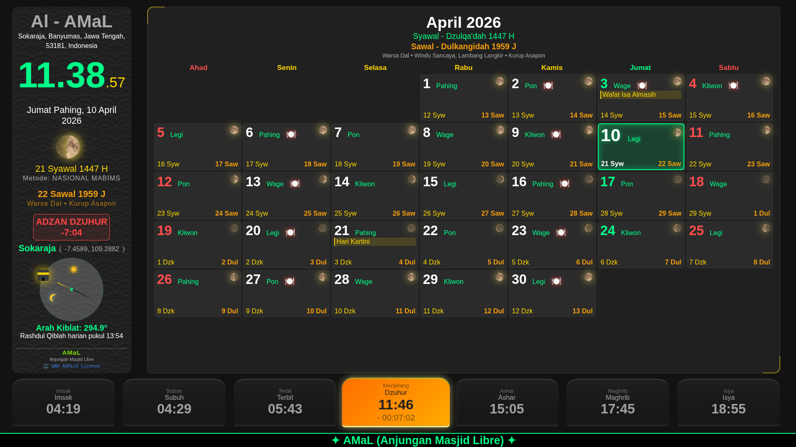
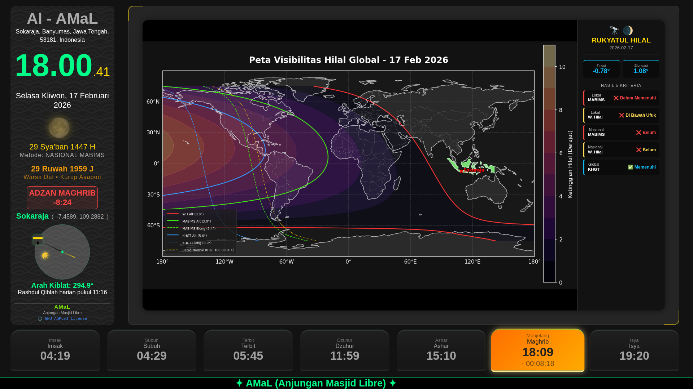
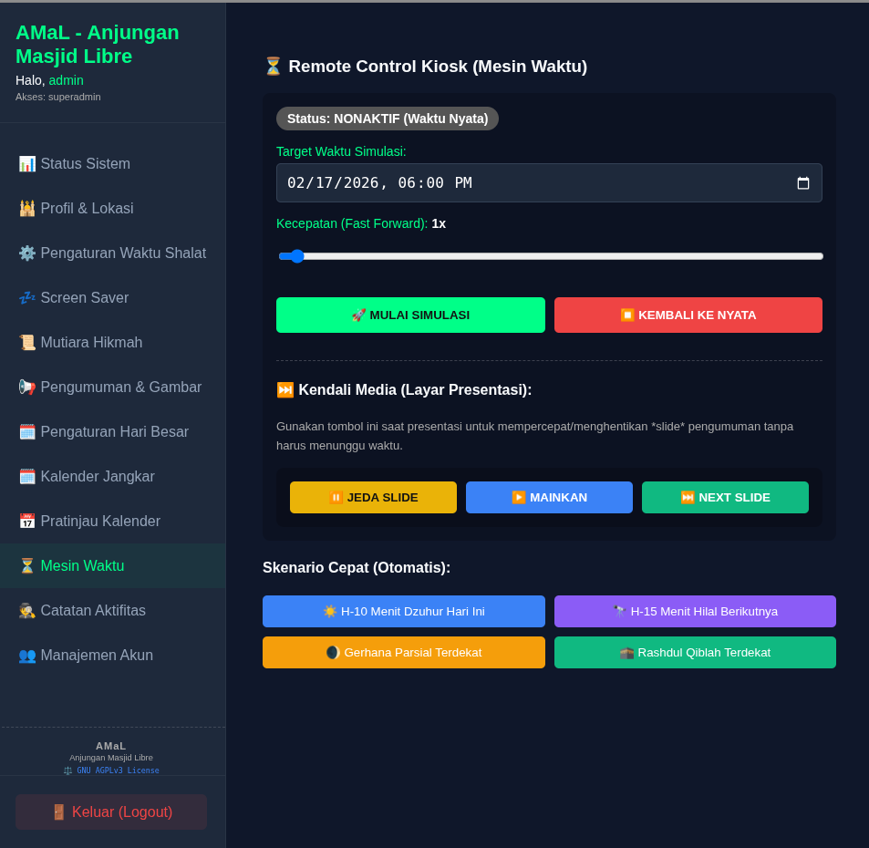

# AMaL (Anjungan Masjid Libre)


**AMaL** adalah sebuah mesin *smart kiosk* (anjungan pintar) berlisensi AGPL dengan semangat FLOSS (*Free Libre Open Source Software*) yang dirancang khusus untuk menunjang informasi dan edukasi di lingkungan masjid.

Tidak hanya sekedar menampilkan jadwal sholat, pengumuman, dan mutiara hikmah, **AMaL** juga dibekali dengan **mesin komputasi astronomi (*real-time*)** dengan fitur:
* 🌒 Visualisasi penampakan hilal secara dinamis
* 🕋 Perhitungan Rashdul Qiblah (kalibrasi arah kiblat)
* 🌘 Prediksi kejadian gerhana matahari dan bulan
* 📅 Konversi penanggalan Masehi, Hijriah, dan Jawa (Pasaran/Kurup)

**Arsitektur AMaL**
Secara arsitektur, **AMaL** dapat beroperasi 100% luring (*offline*) tanpa memerlukan koneksi internet. **AMaL** juga dioptimalkan agar dapat berjalan lancar pada *Mini PC* atau *Single Board Computer* (SBC) seperti Raspberry Pi.

**Filosofi AMaL**
* **Edukasi:** **AMaL** ditujukan sebagai media informasi dan edukasi bagi umat terutama terkait peristiwa astronomi Islam guna mendorong sikap saling menghargai perbedaan. 
* **Amal Jariyah:** **AMaL** dirilis di bawah lisensi AGPL untuk memastikan sistem ini selamanya terbuka, tidak pernah diprivatisasi, dan tetap menjadi milik umat sehingga bebas digunakan olah masjid manapun. Keterbukaan lisensi ini memastikan setiap kontributor yang menyempurnakan dan menyebarkan kodenya turut merajut untaian *amal jariyah* yang manfaatnya mengalir tiada terputus.

---

## ✨ Fitur Unggulan

Fitur-fitur **AMaL** dapat dikelompokkan menjadi 4 pilar utama:

### 🕰️ 1. Pusat Waktu & Penanggalan Presisi
Tidak ada lagi penyesuaian (*offset*) hari secara manual. AMaL menghitung posisi benda langit secara mandiri.
* **Kalender Hijriah Komputasional:** Dihitung langsung menggunakan algoritma astronomi berdasarkan kriteria **Wujudul Hilal, MABIMS, dan KHGT**.
* **Sistem Penanggalan Lengkap & Kultural:** Tampilan utamanya adalah kelender Hijrian dan Masehi. AMaL juga memiliki pilihan menampilkan kalender Jawa sebagai warisan budaya lokal.
* **Jadwal Sholat & Arah Kiblat:** Disesuaikan dengan presisi titik koordinat lokal masjid.
* **Pengingat Puasa:** Menampilkan jadwal puasa wajib dan sunnah secara otomatis di layar utama.
* **Manajemen Hari Libur:** Mengakomodasi hari libur/besar rutin tahunan (Hijriah/Masehi) maupun kejadian insidentil.

### 📢 2. Papan Informasi Cerdas (*Smart Signage*)
Mesin pengumunan otomatis yang dinamis sebagai sarana komunikasi antara takmir dan jemaah.
* **Transparansi Keuangan (Kas Masjid):** Slide informasi keuangan sederhana yang menampilkan rekapitulasi saldo, pemasukan, dan pengeluaran masjid.
* **Pengumuman Berbobot Cerdas:** Pengumuman (dapat berupa teks/gambar) dilengkapi dengan batas waktu dan bobot prioritas. Semakin dekat dengan batas waktu, pengumuman akan semakin sering muncul di layar.
* **Manajemen Konten Fleksibel:** Fitur Aktif/Sembunyikan memungkinkan takmir mengarsipkan pengumuman atau mutiara hikmah sementara waktu tanpa perlu menghapus datanya.
* **Mutiara Hikmah:** Menampilkan kutipan ayat, hadits, atau kata mutiara secara bergantian.
* **Running Text:** Teks berjalan untuk informasi singkat dan cepat.

### 🔭 3. Modul Edukasi Astronomi Islam
Menjadikan anjungan masjid AMaL sebagai media edukasi sains bagi jemaah.
* **Planetarium Mini Real-Time:** Visualisasi orbit Matahari ☀️ dan Bulan 🌙 yang bergerak secara presisi mengelilingi kompas kiblat sesuai posisinya di langit masjid saat itu.
* **Edukasi Rashdul Qiblah:** Memberikan informasi dinamis peristiwa Istiwa A'zam (saat matahari tepat di atas Ka'bah) atau Rashdul Qiblah global dan Rashdul Qiblah lokal (saat bayangan matahari searah dengan arah kiblat) guna mengingatkan jemaah mengkalibrasi arah kiblat lokal.
* **Ilustrasi Fase Bulan Harian:** Menampilkan gambar fase bulan secara visual dan akurat setiap harinya.
* **Edukasi Penentuan Awal Bulan:** Menampilkan hasil komputasi posisi hilal saat matahari terbenam menjelang hari Ijtima terdekat sebelum dan sesudahnya.
* **Edukasi Gerhana:** Pengambilalihan layar (*takeover*) dengan informasi terkait sholat shunah kusuf dan khusuf menjelang terjadinya gerhana matahari atau bulan.

### ⚙️ 4. Sistem, Manajemen & Simulasi
Memberikan kemudahan administrator dan menjaga keawetan perangkat keras (*hardware*).
* **100% Standalone:** Bekerja penuh secara luring (*offline*). Tidak bergantung pada API eksternal dan koneksi internet, sangat cocok untuk masjid di daerah pelosok.
* **Proteksi Layar (*Tri-State Display*):** Dilengkapi mode *Screensaver* (Jam Melayang) untuk jam-jam siang yang sepi, dan mode *Blackout* (Layar Mati Total) pada malam hari untuk menghemat listrik dan mencegah *burn-in* (layar berbayang) pada monitor/TV.
* **Fitur Simulasi (Mesin Waktu):** Administrator dapat memutar waktu sistem untuk melihat bagaimana tampilan AMaL pada waktu tertentu (misal: menguji tampilan menjelang gerhana, simulasi menjelang Rashdul Qiblah atau simulasi Ijtima).
* **Panel Pengaturan (*Settings*):** Antarmuka khusus untuk mengatur informasi dan koordinat masjid, menyesuaikan kriteria kalender Hijriah, pengaturan masa tunggu Iqomah, hingga durasi waktu shalat untuk mematikan layar pada saat shalat dilaksanakan.
* **Manajemen Pengguna:** Akses login berlapis untuk administrator dan operator harian (Takmir).

---

## 📸 Tangkapan Layar (*Screenshots*)

### Video singkat
Video singkat dapat dilihat pada: [Video AMaL](https://www.youtube.com/playlist?list=PLqUB0088cq0EZ_povA_vfumOYxDQ3xgA7)

### Galeri gambar
| Fitur | Gambar |
| --- | --- |
| Tampilan Utama|  |
| Edukasi Hilal (Menjelang Ijtima) | |
| Panel Administrasi| |
---

## 🚀 Panduan Instalasi (Mulai Cepat)

Panduan lengkap untuk memasang AMaL di komputer lokal atau Raspberry Pi.
Catatan: jika dipasang di Raspberry Pi maka diperlukan pemasangan RTC. **AMaL** telah dicoba dan berjalan dengan baik pada Raspberry Pi 4 Model B dengan OS DietPi dengan ntp untuk sinkronisasi waktu.

### Prasyarat Sistem
* Python 3.9+

### Langkah Instalasi
1. Kloning repositori ini:
   ```bash
   git clone [https://github.com/aswinte/AMaL.git](https://github.com/aswinte/AMaL.git)
   cd AMaL
2. Buat virtual environment dan instal dependensi:
   ```
   python3 -m venv venv
   source venv/bin/activate  # Untuk Windows: venv\Scripts\activate
   pip install -r requirements.txt
3. Jalankan aplikasi
   ```
   python app.py
4. Buka peramban dan akses http://localhost:5000.
---
## 🤝 Kontribusi
Kami sangat menunggu kontribusi dari komunitas! Jika Anda ingin menambahkan fitur, memperbaiki bug, atau menyempurnakan dokumentasi, silakan buat Pull Request.
---
## 📄 Lisensi
Proyek ini didistribusikan di bawah lisensi GNU AGPLv3. Lihat berkas LICENSE untuk informasi lebih lanjut. Pada intinya, Anda bebas menggunakan, memodifikasi, dan mendistribusikan perangkat lunak ini, dengan syarat perbaikan/modifikasi yang Anda lakukan harus dikembalikan ke ranah publik/sumber terbuka dengan lisensi yang sama.